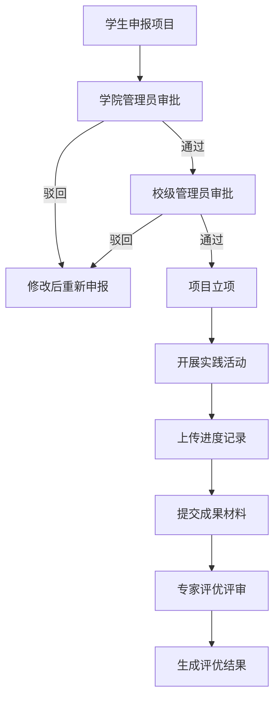

# 三下乡活动管理系统

大学生暑期"三下乡"社会实践活动管理系统，包含微信小程序前端和 Node.js 后端。

## 📋 项目概述

本系统为高校三下乡社会实践活动提供完整的管理解决方案，支持项目申报、审批管理、进度跟踪、成果提交、评优评审等全流程管理。

### 🎯 核心功能

- **项目申报管理**: 学生在线申报项目，支持多种项目类型
- **分级审批流程**: 学院审批 → 校级审批，支持驳回和修改
- **进度实时跟踪**: 实践过程记录，图片、文字、评论互动
- **成果材料管理**: 支持多种格式文件上传和展示
- **评优评审系统**: 专家在线评分，自动排名生成
- **通知公告发布**: 系统消息推送，重要公告发布
- **多角色权限**: 学生、教师、学院管理员、校级管理员、评审专家

## 🏗️ 项目结构

```
youth-rural/
├── sxs-admin/                    # 后端服务 (Node.js + Express + MySQL)
│   ├── src/
│   │   ├── app.js                # 入口文件
│   │   ├── config/               # 配置文件
│   │   │   └── db.js             # 数据库配置
│   │   ├── middleware/           # 中间件
│   │   │   ├── auth.js           # JWT认证
│   │   │   └── upload.js         # 文件上传
│   │   ├── routes/               # API 路由
│   │   │   ├── auth.js           # 认证接口
│   │   │   ├── user.js           # 用户管理
│   │   │   ├── project.js        # 项目管理
│   │   │   ├── approval.js       # 审批管理
│   │   │   ├── progress.js       # 进度管理
│   │   │   ├── result.js         # 成果管理
│   │   │   ├── evaluation.js     # 评优管理
│   │   │   └── notice.js         # 通知管理
│   │   └── utils/                # 工具函数
│   │       ├── response.js       # 响应格式化
│   │       └── noticeHelper.js   # 通知助手
│   ├── database/                 # 数据库脚本
│   │   ├── schema.sql            # 表结构
│   │   ├── complete_demo_data.sql # 完整演示数据
│   │   ├── student_demo_data.sql # 学生专项数据
│   │   └── demo_data_correct.sql # 基础数据
│   ├── scripts/                  # 初始化脚本
│   │   ├── init_complete_demo.js # 完整数据初始化
│   │   ├── init_student_demo.js  # 学生数据初始化
│   │   ├── init_demo_data.js     # 基础数据初始化
│   │   └── quick_start.js        # 一键启动脚本
│   ├── uploads/                  # 上传文件目录
│   ├── package.json              # 依赖配置
│   └── .env.example              # 环境变量示例
├── sxs-miniapp/                  # 微信小程序前端
│   ├── pages/                    # 页面
│   │   ├── index/                # 首页
│   │   ├── activity/             # 活动管理
│   │   │   ├── apply-list.js     # 项目列表
│   │   │   ├── apply-detail.js   # 项目详情
│   │   │   └── apply-create.js  # 项目创建
│   │   ├── project/              # 项目管理
│   │   │   └── workspace.js      # 项目工作台
│   │   ├── approve/              # 审批管理
│   │   │   ├── list.js           # 审批列表
│   │   │   └── detail.js         # 审批详情
│   │   ├── evaluation/           # 评优管理
│   │   └── notice/               # 通知公告
│   ├── utils/                    # 工具函数
│   │   ├── api.js                # API接口封装
│   │   ├── request.js            # 请求工具
│   │   └── auth.js               # 认证工具
│   ├── app.js                    # 小程序入口
│   └── app.json                  # 小程序配置
├── setup.sh                      # 一键环境安装脚本
├── start.sh                      # 快速启动脚本
├── QUICK_START.md                # 快速启动指南
├── DEMO_DATA_SUCCESS.md          # 演示数据说明
├── DEPLOYMENT_SUMMARY.md         # 部署总结
└── README.md                     # 项目说明文档
```

## 🚀 快速开始

### 环境要求

- **Node.js** >= 14.0.0
- **MySQL** >= 5.7.0
- **npm** >= 6.0.0
- **微信开发者工具** 最新版

### 🔧 环境安装

#### 方法一：一键环境安装（推荐）

```bash

# 运行环境安装脚本
chmod +x setup.sh
./setup.sh
```

#### 方法二：手动环境安装

```bash
# 1. 安装 Node.js (https://nodejs.org/)
# 2. 安装 MySQL (https://dev.mysql.com/downloads/)
# 3. 安装微信开发者工具 (https://developers.weixin.qq.com/miniprogram/dev/devtools/download.html)

# 4. 验证环境
node --version    # >= 14.0.0
npm --version     # >= 6.0.0
mysql --version   # >= 5.7.0
```

### 📊 数据库配置

#### 1. 创建数据库

```bash
# 登录 MySQL
mysql -u root -p

# 创建数据库
CREATE DATABASE sxs_db DEFAULT CHARACTER SET utf8mb4 COLLATE utf8mb4_unicode_ci;

# 退出 MySQL
EXIT;
```


### 🎯 数据初始化

#### 方法一：一键初始化（推荐）

```bash
# 进入后端目录
cd sxs-admin

# 安装依赖
npm install

# 一键初始化所有演示数据
npm run quick-start
```

#### 方法二：分步初始化

```bash
# 1. 初始化表结构
mysql -u root -p123456 sxs_db < database/schema.sql

# 2. 初始化完整演示数据（包含基础数据和学生数据）
npm run init-complete

# 或者分别初始化
# npm run init-demo      # 基础数据
# npm run init-student   # 学生专项数据
```

#### 方法三：手动SQL执行

```bash
# 执行完整数据脚本
mysql -u root -p123456 sxs_db < database/complete_demo_data.sql
```

### 🚀 启动服务

#### 启动后端服务

```bash
# 进入后端目录
cd sxs-admin

# 开发模式启动
npm run dev

```

**服务地址：** http://localhost:3000

#### 启动小程序

1. 打开微信开发者工具
2. 选择"导入项目"
3. 项目目录选择 `sxs-miniapp`
4. AppID 选择"测试号"
5. 在「详情」-「本地设置」中勾选「不校验合法域名、web-view（业务域名）、TLS 版本以及 HTTPS 证书」
6. 点击"编译"启动项目

## 📱 使用指南

### 🔑 测试账号

所有账号密码均为：`123456`

| 角色             | 账号    | 姓名         | 主要功能                               |
| ---------------- | ------- | ------------ | -------------------------------------- |
| 👨‍🎓 **学生**       | 2021001 | 张三         | 项目申报、进度上传、成果提交、查看评优 |
| 👨‍🎓 学生           | 2021002 | 李四         | 项目申报、进度上传、成果提交           |
| 👨‍🎓 学生           | 2022001 | 王五         | 项目申报、进度上传、成果提交           |
| 👨‍🏫 **教师**       | t_wang  | 王教授       | 查看指导项目、添加反馈、成果汇总       |
| 👨‍🏫 教师           | t_li    | 李老师       | 查看指导项目、添加反馈                 |
| 🏢 **学院管理员** | ca_jg   | 经管院管理员 | 学院级项目审批、发布通知               |
| 🏢 学院管理员     | ca_jy   | 教育院管理员 | 学院级项目审批、发布通知               |
| 🎓 **校级管理员** | admin   | 系统管理员   | 校级审批、发布通知、系统管理           |
| 👨‍⚖️ **评审专家**   | e_chen  | 陈专家       | 项目评审打分、查看评优结果             |
| 👨‍⚖️ 评审专家       | e_zhou  | 周专家       | 项目评审打分、查看评优结果             |

### 🎭 演示数据说明

#### 学生账号 (2021001) 项目数据
- **6个项目**，覆盖所有状态（无草稿状态）
- **待审核**: 社区志愿服务活动
- **学院已审**: 传统文化进校园  
- **已立项**: 环保意识调研（含进度和成果）
- **已驳回**: 科技创新实践（含驳回原因）
- **已撤回**: 健康生活推广
- **已结项**: 乡村振兴调研实践

#### 关联数据
- 每个项目3名成员
- 完整的审批记录
- 已立项项目有进度记录和成果材料
- 相关的系统消息通知

## 📡 API 接口

### 基础信息
- **服务地址**: `http://localhost:3000`


## 🔄 业务流程



## 🔧 故障排除

### 常见问题

#### 1. 数据库连接失败
```bash
# 检查MySQL服务状态
brew services start mysql  # macOS
sudo systemctl start mysql # Linux

# 检查数据库配置
mysql -u root -p123456 -e "SHOW DATABASES;"

# 重置数据库密码
mysql -u root -p
ALTER USER 'root'@'localhost' IDENTIFIED BY '123456';
```

#### 2. 端口被占用
```bash
# 查看端口占用
lsof -i :3000

# 杀死占用进程
kill -9 <PID>

# 修改端口
# 编辑 sxs-admin/.env 文件中的 PORT 配置
```

#### 3. 依赖安装失败
```bash
# 清除npm缓存
npm cache clean --force

# 删除node_modules重新安装
rm -rf node_modules package-lock.json
npm install
```

#### 4. 小程序无法连接后端
```bash
# 检查后端服务状态
curl http://localhost:3000/api/auth/login

# 检查网络配置
# 确保小程序开发工具中勾选"不校验合法域名"

# 检查API地址配置
# 编辑 sxs-miniapp/utils/request.js 中的 baseURL
```

#### 5. 数据初始化失败
```bash
# 手动执行数据初始化
cd sxs-admin
npm run init-complete

# 或直接执行SQL
mysql -u root -p123456 sxs_db < database/complete_demo_data.sql

# 验证数据
mysql -u root -p123456 -e "USE sxs_db; SELECT COUNT(*) as project_count FROM project;"
```

### 日志查看

```bash
# 后端日志（开发模式）
npm run dev

# 数据库日志
tail -f /usr/local/var/mysql/mysql.log  # macOS
tail -f /var/log/mysql/error.log       # Linux

# 小程序日志
# 在微信开发者工具的"Console"面板查看
```
