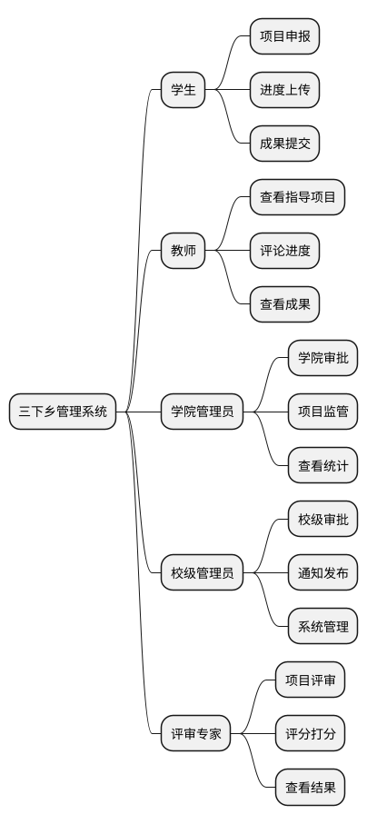
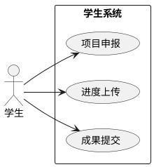
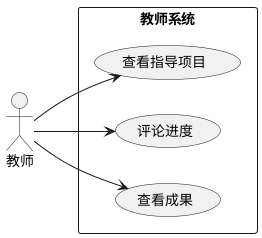
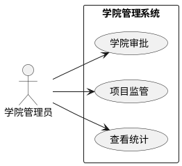
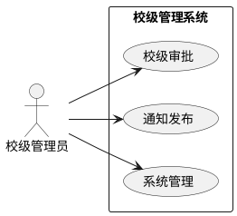
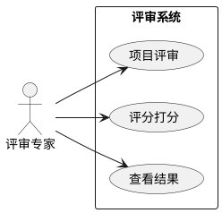

# 三下乡活动管理系统 - 功能架构图

## 一、功能层次图（三级）

## 二、角色用例图

### 2.1 学生用例图

### 2.2 教师用例图

### 2.3 学院管理员用例图

### 2.4 校级管理员用例图

### 2.5 评审专家用例图

## 三、角色权限矩阵

| 用例/角色 | 学生 | 教师 | 学院管理员 | 校级管理员 | 评审专家 |
|-----------|:--:|:--:|:--:|:--:|:--:|
| 项目申报 | ✓ | - | - | - | - |
| 学院审批 | - | - | ✓ | - | - |
| 校级审批 | - | - | - | ✓ | - |
| 进度上传 | ✓ | - | - | - | - |
| 评论进度 | - | ✓ | ✓ | ✓ | - |
| 成果提交 | ✓ | - | - | - | - |
| 项目评审 | - | - | - | - | ✓ |
| 评分打分 | - | - | - | - | ✓ |
| 通知发布 | - | - | - | ✓ | - |
| 系统管理 | - | - | - | ✓ | - |
