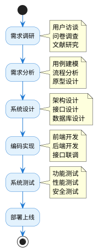

# 第一章 绪论

## 1.1 研究背景

大学生暑期"三下乡"社会实践活动是指高校组织大学生在暑假期间深入农村基层，开展文化、科技、卫生等方面服务的社会实践活动。自1997年中央宣传部、教育部、共青团中央联合发起以来，"三下乡"活动已成为高校实践育人的重要载体，每年有数百万大学生参与其中。

随着活动规模的不断扩大和管理要求的日益提高，传统的纸质化、人工化管理方式已难以适应新形势下的管理需求。具体表现在以下几个方面：

**（1）信息传递效率低下**

传统管理模式下，活动通知、政策文件等信息主要通过层层转发的方式传递，信息到达学生手中往往存在滞后性，且容易出现信息失真或遗漏的情况。学生获取信息的渠道有限，难以及时了解活动动态。

**（2）审批流程繁琐复杂**

项目申报需要经过指导教师、学院、学校等多级审批，传统方式下需要学生携带纸质材料逐级签字盖章，耗时耗力。审批进度不透明，学生无法实时了解申报状态，影响后续准备工作的开展。

**（3）过程监管存在困难**

实践活动开展期间，学生分散在各地进行实践，管理部门难以实时掌握各团队的活动进展情况。传统的电话汇报、定期总结等方式存在信息滞后、真实性难以核实等问题。

**（4）成果管理不够规范**

活动结束后，各类实践成果（调研报告、实践日志、影像资料等）的收集、整理、归档工作量大，且容易出现材料丢失、格式不统一等问题，不利于成果的展示和推广。

**（5）评优评审缺乏标准**

优秀团队和个人的评选往往依赖人工评审，评审标准不够统一，评审过程不够透明，难以保证评选结果的公平公正。

与此同时，移动互联网技术的快速发展为解决上述问题提供了新的思路。微信小程序作为一种轻量级的移动应用形态，具有无需下载安装、即用即走、开发成本低等优势，已在各行各业得到广泛应用。将微信小程序技术应用于"三下乡"活动管理，可以有效提升管理效率，改善用户体验。

## 1.2 研究目的与意义

### 1.2.1 研究目的

本研究旨在设计并实现一套基于微信小程序的大学生暑期"三下乡"活动管理系统，通过信息化手段解决传统管理模式中存在的问题，实现以下目标：

（1）构建统一的信息发布平台，实现活动通知、政策文件等信息的及时推送，确保信息传递的时效性和准确性。

（2）建立规范的线上审批流程，实现项目申报的在线提交和多级审批，提高审批效率，增强流程透明度。

（3）搭建实时的进度跟踪机制，支持实践团队在线上传活动进展，便于管理部门及时掌握各团队动态。

（4）完善成果管理功能，支持多种格式成果材料的在线提交和展示，规范成果归档流程。

（5）实现评优评审的信息化，建立统一的评审标准和在线评分机制，确保评选过程公开透明。

### 1.2.2 研究意义

**（1）理论意义**

本研究将信息系统开发理论与高校社会实践活动管理实际相结合，探索了微信小程序技术在教育管理领域的应用模式，丰富了高校信息化建设的理论研究。同时，本研究对多角色、多流程的复杂业务系统设计进行了实践探索，为类似系统的开发提供了参考。

**（2）实践意义**

从管理角度看，本系统的应用可以显著提升"三下乡"活动的管理效率，减轻管理人员的工作负担，实现管理工作的规范化、标准化。从用户角度看，系统为学生提供了便捷的申报渠道和信息获取途径，提升了参与体验。从数据角度看，系统积累的历史数据可为活动效果评估、政策制定等提供数据支撑。

## 1.3 国内外研究现状

### 1.3.1 国外研究现状

国外高校普遍重视学生社会实践活动的组织管理。美国高校的服务学习（Service-Learning）项目、英国高校的志愿服务项目等都建立了较为完善的管理体系。在信息化管理方面，国外高校主要依托综合性的学生事务管理系统或专门的志愿服务管理平台进行管理。

例如，美国的GivePulse平台是一个广泛应用于高校的志愿服务管理系统，支持活动发布、志愿者招募、服务时长记录、影响力评估等功能。英国的Volunteering Canterbury平台则专注于大学生志愿服务的组织协调，提供了完善的项目管理和数据统计功能。

这些系统的共同特点是：功能模块化设计、注重用户体验、强调数据分析。但由于国情差异，这些系统难以直接应用于我国高校"三下乡"活动的管理。

### 1.3.2 国内研究现状

近年来，国内学者对高校社会实践活动管理信息化进行了积极探索。在理论研究方面，相关学者分析了高校社会实践活动管理中存在的问题，提出了信息化管理的改进建议，探讨了移动互联网技术在高校学生管理中的应用前景。

在系统开发方面，部分高校已开发了社会实践管理系统。清华大学的"实践在线"平台实现了社会实践项目的全流程管理；浙江大学的社会实践管理系统支持项目申报、过程管理、成果展示等功能。但这些系统多基于Web端开发，移动端体验有待提升。

随着微信小程序的兴起，基于小程序的校园应用开发成为研究热点。相关研究设计了基于微信小程序的高校志愿服务管理系统、大学生社会实践申报系统等，为本课题提供了有益参考。

总体来看，现有研究在以下方面仍有不足：一是功能覆盖不够全面，多数系统仅实现了部分功能模块；二是角色设计不够完善，难以满足多角色协同管理的需求；三是用户体验有待提升，界面设计和交互逻辑需要优化。

## 1.4 研究内容与技术路线

### 1.4.1 研究内容

本研究的主要内容包括：

（1）需求分析：通过调研分析，明确系统的功能需求和非功能需求，确定系统的用户角色和业务流程。

（2）系统设计：进行系统架构设计、功能模块设计、数据库设计，制定详细的技术方案。

（3）系统实现：基于微信小程序和Node.js技术栈，完成系统各功能模块的编码实现。

（4）系统测试：对系统进行功能测试、性能测试和安全测试，验证系统的可用性和稳定性。

### 1.4.2 技术路线

本系统采用前后端分离的开发模式，技术路线如下：

- 前端技术选型：微信小程序原生框架（WXML + WXSS + JavaScript）
- 后端技术选型：Node.js + Express + MySQL
- 开发工具：微信开发者工具、Visual Studio Code、Navicat

## 1.5 论文结构安排

本论文共分为七章，各章内容安排如下：

**第一章 绪论**：介绍研究背景、研究目的与意义、国内外研究现状、研究内容与技术路线，以及论文结构安排。

**第二章 相关技术与理论基础**：介绍系统开发所涉及的关键技术，包括微信小程序技术、前端开发技术、后端开发技术、数据库技术等。

**第三章 系统需求分析**：对系统进行详细的需求分析，包括总体需求、功能性需求、非功能性需求和可行性分析。

**第四章 系统总体设计**：进行系统架构设计、功能模块设计、业务流程设计和数据库设计。

**第五章 系统详细实现**：详细描述系统各功能模块的实现过程，包括关键代码和界面展示。

**第六章 系统测试**：对系统进行全面测试，包括功能测试、性能测试和安全测试，并分析测试结果。

**第七章 总结与展望**：总结研究工作，分析系统不足，展望未来发展方向。
